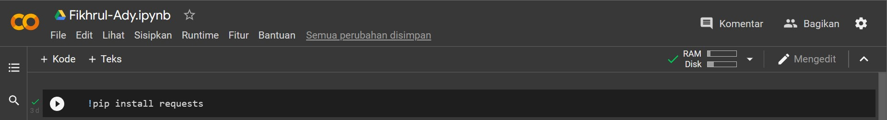
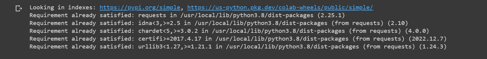
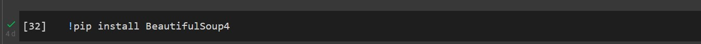
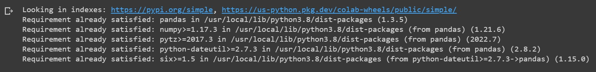
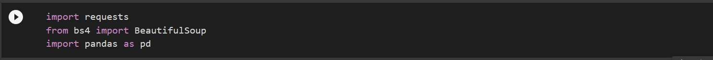
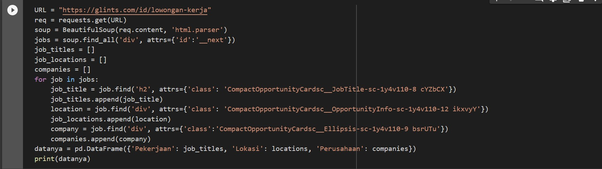

# Pratikum11

## Chalenge:

- Menginstall pip:
Source code:
```
!pip install requests
```

- Ouputnya:


- Kemudian Install pip BeautifulSoup:
Source code:
```
!pip install BeautifulSoup4
```

- Ouputnya:


- Begitupula install pip Pandas:
Source code:
```
!pip install pandas
```

- Ouputnya:


- Jangan lupa menggunakan import supaya bisa tersambung dengan pip-nya:
Source code:
```
import requests
from bs4 import BeautifulSoup
import pandas as pd
```


- Kemudian Masukkan Code untuk membuatnya:
Source code:
```
URL = "https://glints.com/id/lowongan-kerja"
req = requests.get(URL)
soup = BeautifulSoup(req.content, 'html.parser')
jobs = soup.find_all('div', attrs={'id':'__next'})
job_titles = []
job_locations = []
companies = []
for job in jobs:
    job_title = job.find('h2', attrs={'class': 'CompactOpportunityCardsc__JobTitle-sc-1y4v110-8 cYZbCX'})
    job_titles.append(job_title)
    location = job.find('div', attrs={'class': 'CompactOpportunityCardsc__OpportunityInfo-sc-1y4v110-12 ikxvyY'})
    job_locations.append(location)
    company = job.find('div', attrs={'class':'CompactOpportunityCardsc__Ellipsis-sc-1y4v110-9 bsrUTu'})
    companies.append(company)
datanya = pd.DataFrame({'Pekerjaan': job_titles, 'Lokasi': locations, 'Perusahaan': companies})
print(datanya)
```

- Dan yang terakhir maka ouputnya akan seperti ini:


### Sekian dan Terimakasih, saya memohon maaf sebesar-besarnya bilamana masih banyak kesalahan dari hal perkodingan